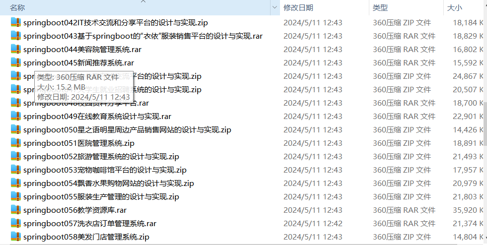

# springboot_job_crm_market_food_dorm
📦 **SpringBoot多功能项目仓库** 🎯

本仓库汇集了五个基于 **Spring Boot** 开发的高实用性项目，涵盖 **兼职招聘、客户管理、在线超市、美食分享、宿舍管理** 等多个领域，适用于学习、开发实践和功能拓展！🚀

💼 **兼职网系统** —— 提供职位发布、在线求职、简历管理、雇主审核等功能，打造高效便捷的兼职招聘平台 📋🔍

🏢 **企业客户管理系统** —— 实现客户信息管理、订单跟踪、业务统计、数据分析，助力企业优化客户关系管理 📊🤝

🛒 **网上超市系统** —— 支持商品管理、购物车、在线支付、订单配送，实现便捷的电商购物体验 🏪🚀

🍽️ **校园周边美食探索及分享系统** —— 提供美食推荐、商家评价、用户分享、个性化推荐，助力校园周边餐饮服务升级 🌮📍

🏫 **学生宿舍管理系统** —— 集成宿舍分配、入住登记、维修报修、考勤管理，提升校园后勤管理效率 🏠✅

所有项目均基于 **Spring Boot** 开发，结合 **MySQL、Redis、Vue.js** 等主流技术，具备良好的扩展性与实用性。欢迎 **Star & Fork**，一起交流学习！🚀

项目部署说明✨：

推荐使用：谷歌浏览器

后台地址😎
http://localhost:8080/springboot/admin/dist/index.html

管理员  abo 密码 abo

前台地址😎

http://localhost:8080/springboot/front/index.html

在src\main\resources\application.yml中编辑数据库配置🎉										
url: jdbc:mysql://127.0.0.1:3306/springboot?useUnicode=true&characterEncoding=utf-8&useJDBCCompliantTimezoneShift=true&useLegacyDatetimeCode=false&serverTimezone=UTC
username: root
password: 123456

文档预览👀

其他项目合集✨

